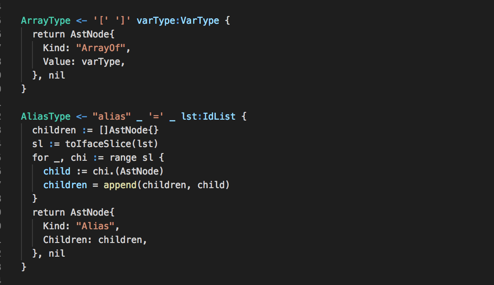

# go-pigeon

Provides language support for the [pigeon](https://github.com/mna/pigeon) PEG parser for Go (golang)

## Features

- [x] Embedded highlighting for Go actions
- [x] Basic highlighting of:
  - [x] rule names
  - [x] String and character literals
  - [x] Tagged variables
- [ ] full rule expression highlighting

## Known Issues

- Rules are not fully parsed yet
- Go actions seem to lack some full highlighting
  - May be because they ultimately are functions lacking function scope

<!--
## Release Notes

Users appreciate release notes as you update your extension.

### 1.0.0

Initial release of ...

### 1.0.1

Fixed issue #.

### 1.1.0

Added features X, Y, and Z.

-----------------------------------------------------------------------------------------------------------

## Working with Markdown

**Note:** You can author your README using Visual Studio Code.  Here are some useful editor keyboard shortcuts:

* Split the editor (`Cmd+\` on macOS or `Ctrl+\` on Windows and Linux)
* Toggle preview (`Shift+CMD+V` on macOS or `Shift+Ctrl+V` on Windows and Linux)
* Press `Ctrl+Space` (Windows, Linux) or `Cmd+Space` (macOS) to see a list of Markdown snippets

### For more information

* [Visual Studio Code's Markdown Support](http://code.visualstudio.com/docs/languages/markdown)
* [Markdown Syntax Reference](https://help.github.com/articles/markdown-basics/)

**Enjoy!**

-->